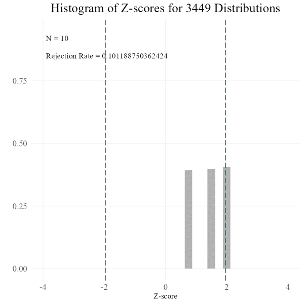

<!-- README.md is generated from README.Rmd. Please edit that file -->

# eccentric 

<!-- badges: start -->
<!-- badges: end -->

The goal of eccentric is to …

## Installation

You can install the development version of eccentric like so:

``` r
# devtools::install::github("jpmonteagudo28/eccentric")
```

## Example

This is a basic example which shows you how to solve a common problem:

``` r
library(eccentric)

# Create a vector of sample sizes
n = n = c(10,25,30,50,70,100,200,500,900)

# Sample an exponential distribution 3449 times, drawing 10,25,70,100,200,500 and 900 points
# for each simulation and build a data frame
data <- simulate_clt(n = n,
                     inverse = "rexp",
                     samples = 3449,
                     rate = 2.35)
#> Extra arguments will be passed to inverse function


# Evaluate the percentage of z-score beyond the desired critical value
a <- evaluate_data(data,ci = 1.96)
#> Percentage of Z-Scores Outside1.96 Critical Value for Each Sample Size

 
graph_data(data,ci = 1.96,compile_gif = TRUE,samples = 3449,n = n, a = a)
#> Individual plots saved to working directory
#> Using ImageMagick to create gif...
#> Finished creating gif, saved in the working directory
```

The `graph_data()` function will produce the following output

``` r
knitr::include_graphics(here::here("man","output.gif"))
```


